# HW3 Test Results

## Test Summary

- Total Tests: 12
- Passed: 9
- Failed: 3

## Test Details

### Test 1: Get API Info

- **Method**: GET /
- **Expected**: 200, API documentation
- **Result**: ✅ Pass

## Screenshots

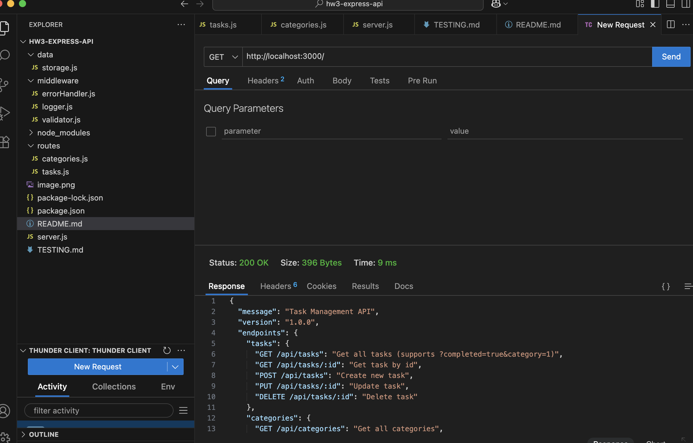

### Test 2: Get All Tasks

- **Method**: GET /api/tasks
- **Expected**: 200, array of tasks
- **Result**: ✅ Pass

## Screenshots

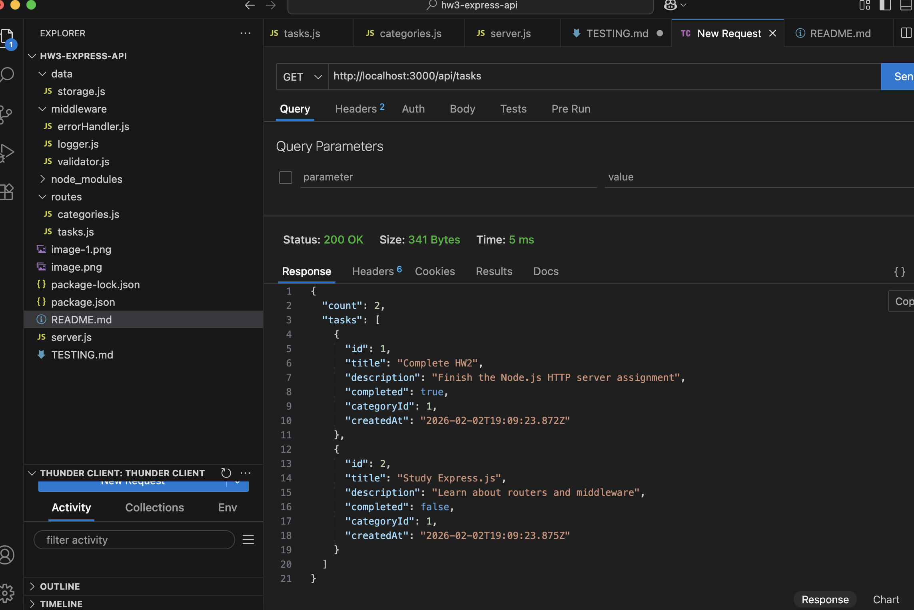

### Test 3: Filter Completed Tasks

- **Method**: GET /api/tasks?completed=true
- **Expected**: 200, array with 1 completed task
- **Result**: ✅ Pass

## Screenshots

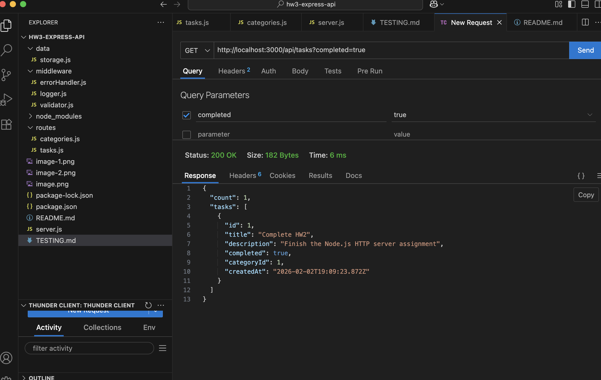

### Test 4: Get Single Task

- **Method**: GET /api/tasks/1
- **Expected**: 200, task object
- **Result**: ✅ Pass

## Screenshots

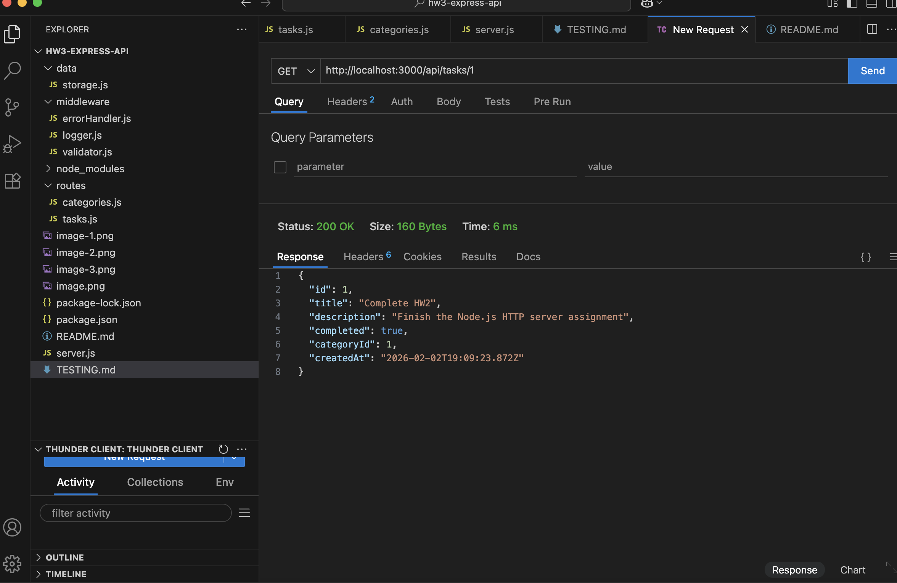

### Test 5: Get Non-existent Task (404)

- **Method**: GET /api/tasks/999
- **Expected**: 404, error message
- **Result**: ❌ Fail

## Screenshots

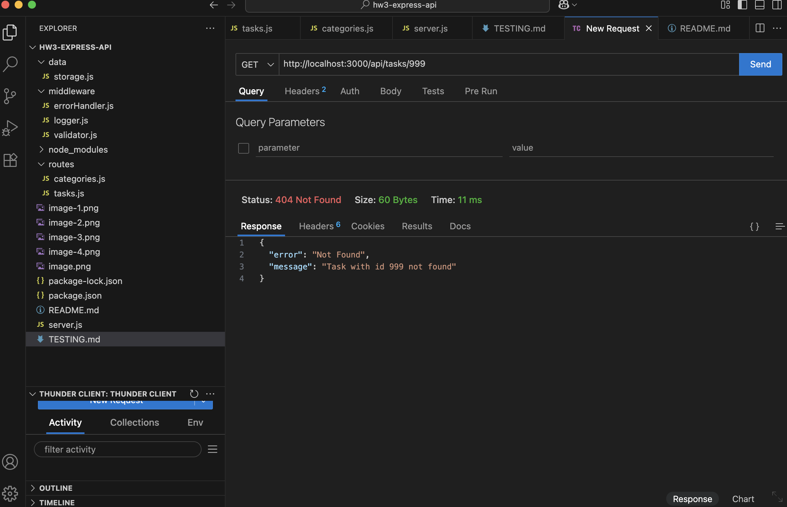

### Test 6: Create Task (Valid)

- **Method**: POST /api/tasks
- **Headers**: Content-Type: application/json
- **Body**:
  {
  "title": "Learn Express Middleware",
  "description": "Complete HW3 assignment",
  "categoryId": 1,
  "completed": false
  }
- **Expected**: 201, new task with id 3
- **Result**: ✅ Pass

## Screenshots

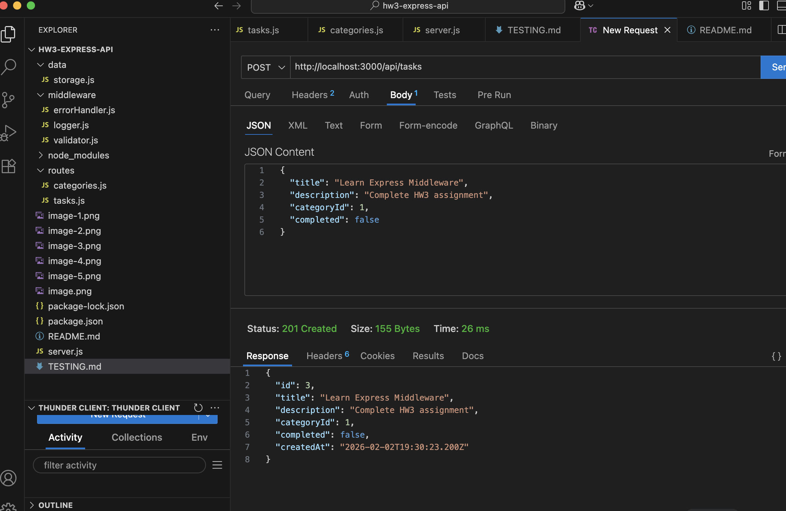

### Test 7: Create Task (Invalid - no title)

- **Method**: POST /api/tasks
- **Headers**: Content-Type: application/json
- **Body**:
  {
  "description": "This should fail"
  }
- **Expected**: 400, validation error
- **Result**: ❌ Fail

## Screenshots

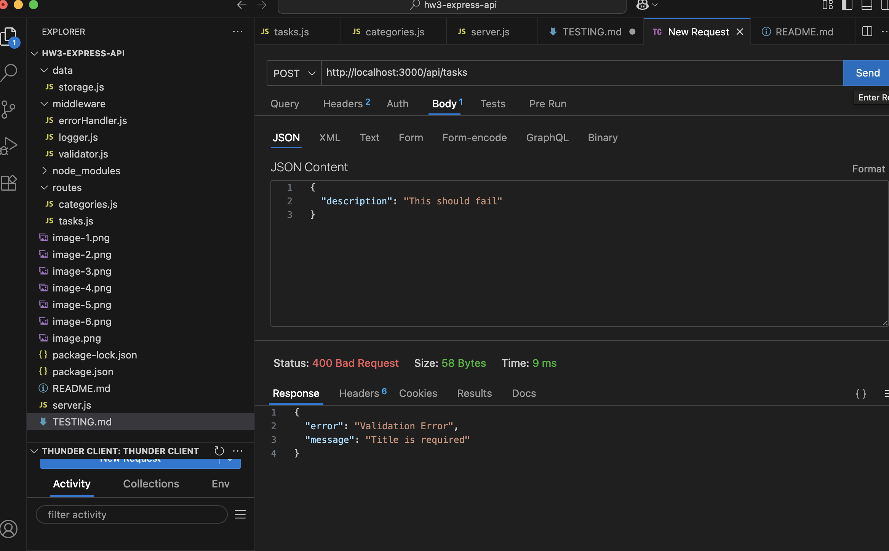

### Test 8: Update Task

- **Method**: PUT /api/tasks/2
- **Headers**: Content-Type: application/json
- **Body**:
  {
  "title": "Study Express.js",
  "description": "Learn about routers and middleware",
  "completed": true,
  "categoryId": 1
  }
- **Expected**: 200, updated task
- **Result**: ✅ Pass

## Screenshots

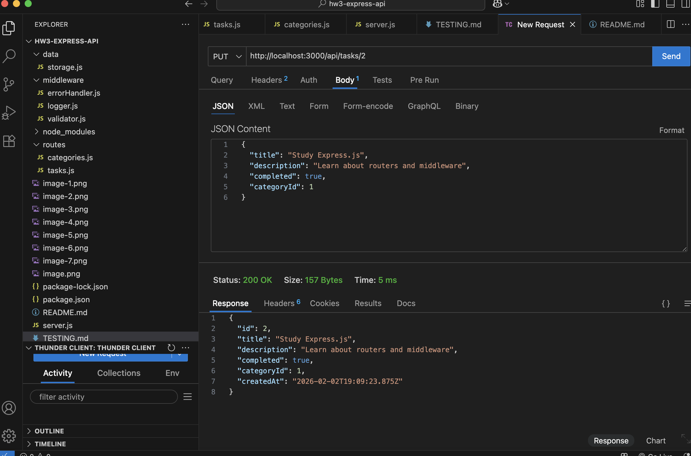

### Test 9: Delete Task

- **Method**: DELETE /api/tasks/1
- **Expected**: 200, success message
- **Result**: ✅ Pass

## Screenshots

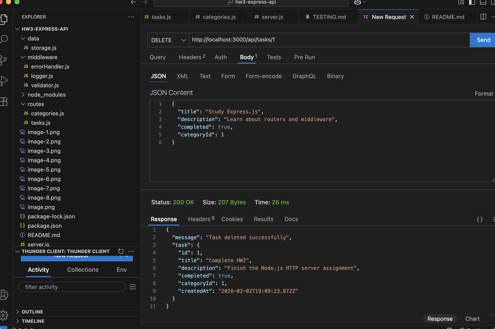

### Test 10: Get Categories

- **Method**: GET /api/categories
- **Expected**: 200, array of 2 categories
- **Result**: ✅ Pass

## Screenshots

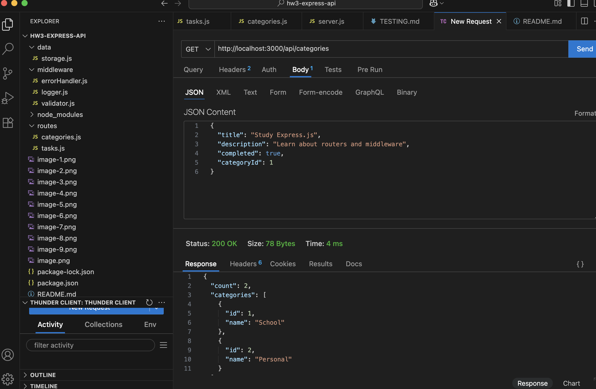

### Test 11: Create Category

- **Method**: POST /api/categories
- **Headers**: Content-Type: application/json
- **Body**:
  {
  "name": "Work"
  }
- **Expected**: 201, new category
- **Result**: ✅ Pass

## Screenshots

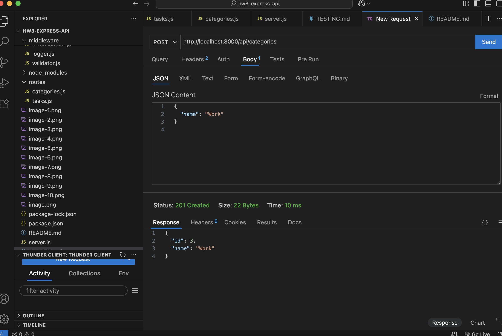

### Test 12: 404 for Unknown Route

- **Method**: GET /api/unknown
- **Expected**: 404, error message
- **Result**: ❌ Fail

## Screenshots

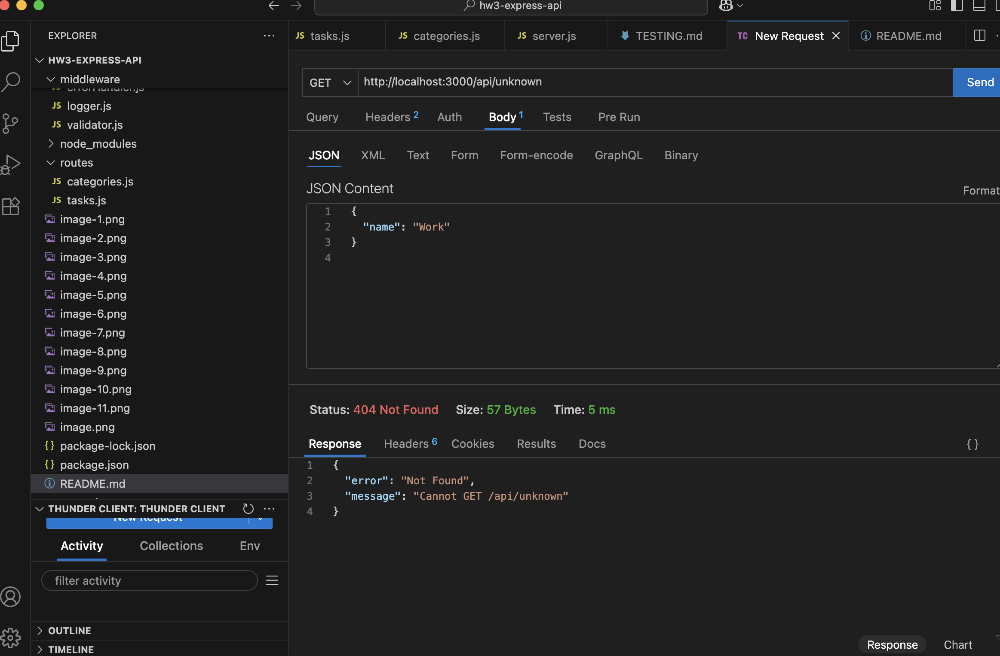
